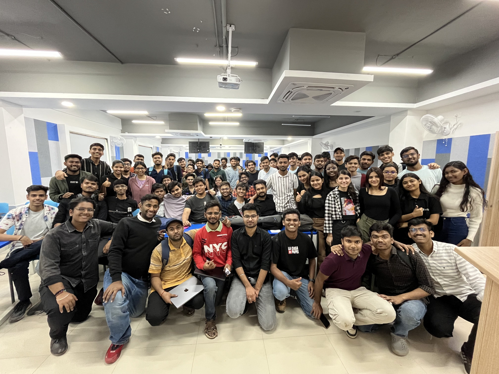

# 🏆 Quick Snatch 2025 - Event Website

    
     
     
    
    
    

## 🌟 Overview

The official website for Quick Snatch 2025, a campus-wide tech challenge organized by NST-SDC (Student Developers Club). This cyberpunk-themed website showcases the event's winners and highlights.

## 🏅 Winners

### 🥇 First Place - Team VIPAX
- Sandesh
- Ansh
- Jatin
- Pushkar
- Swarnim

### 🥈 Second Place - Team Hunterrss
- Vikash
- Sahil
- Suraj
- Rahul
- Divyansh

### 🥉 Third Place - Team Scaler
- Akanksha
- Sahil
- Anirudh
- Anishka

## ✨ Features

- Cyberpunk-inspired design
- Responsive layout for all devices
- Interactive hover effects
- Optimized image loading
- Smooth animations
- Team photo galleries

## 🛠️ Technologies Used

- HTML5
- CSS3 (with modern features)
- JavaScript
- Font Awesome Icons
- Google Fonts (Rajdhani)

## 🎨 Design Elements

- Neon color scheme
- Glowing effects
- Matrix-style animations
- Gradient overlays
- Responsive grid layouts

## 📱 Responsive Design

The website is fully responsive and optimized for:
- Desktop screens
- Tablets
- Mobile devices

## 🔗 Links

- [NST-SDC Official Website](https://www.nstsdc.org/)
- [Instagram](https://www.instagram.com/devclub.nst/)

## 🤝 Contributing

Feel free to contribute to this project by submitting issues or pull requests.

## 📄 License

This project is licensed under the MIT License - see the [LICENSE](LICENSE) file for details.

## 👨‍💻 Developer

Crafted with 💻 by [Daksh](https://github.com/mrgear111)  
Vice President, NST-SDC

---

    Made with ❤️ by NST-SDC

 